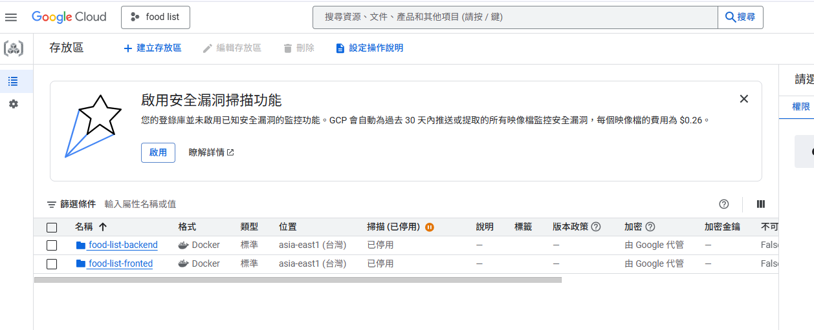
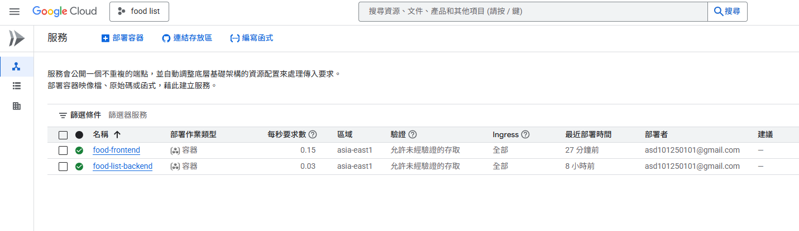

本專題為一個以美食為主題的前後端整合平台，讓使用者能夠查看美食菜單。專案以 Python 的 Flask 作為後端框架，並搭配前端 Next.js 網頁進行互動，已成功部署至 GCP Cloud Run。

---

## 📦 專案架構與部署流程

### 1. 前端連結

- 前端已部署，網站入口如下：
  🔗 [https://food-frontend-1009537220252.asia-east1.run.app](https://food-frontend-1009537220252.asia-east1.run.app)

### 2. Docker 容器化

- 本專案後端以 **Dockerfile** 建構映像，確保部署一致性。
- 使用 `docker build` 打包成 Docker Image，並推送至 GCP Artifact Registry。

### 3. GCP Cloud Run 部署

- 前後端服務以 **Cloud Run** 部署。
- 將儲存在 Artifact Registry 的 image 部署於 Cloud Run 環境中。

### 4. 啟動方式

- flask 部屬時使用 `gunicorn` 作為 WSGI Server

### 5. 專案連結

- Next.js
  🔗 [https://github.com/weijun1923/food-list-frontend](https://github.com/weijun1923/food-list-frontend)
- Flask
  🔗 [https://github.com/weijun1923/food-list-backend](https://github.com/weijun1923/food-list-backend)

## 🧪 測試帳號

- **帳號**：`test@test.com`
- **密碼**：`123456`

提供測試帳號可供老師登入實際操作與體驗功能。

---

## ⚠️ 注意事項

- 此版本尚未完成 **RWD（Responsive Web Design）**，因此目前僅適用於 **桌面瀏覽器（PC）**。
- 手機裝置瀏覽時可能會出現畫面排版錯誤或功能無法使用的情況。

---
